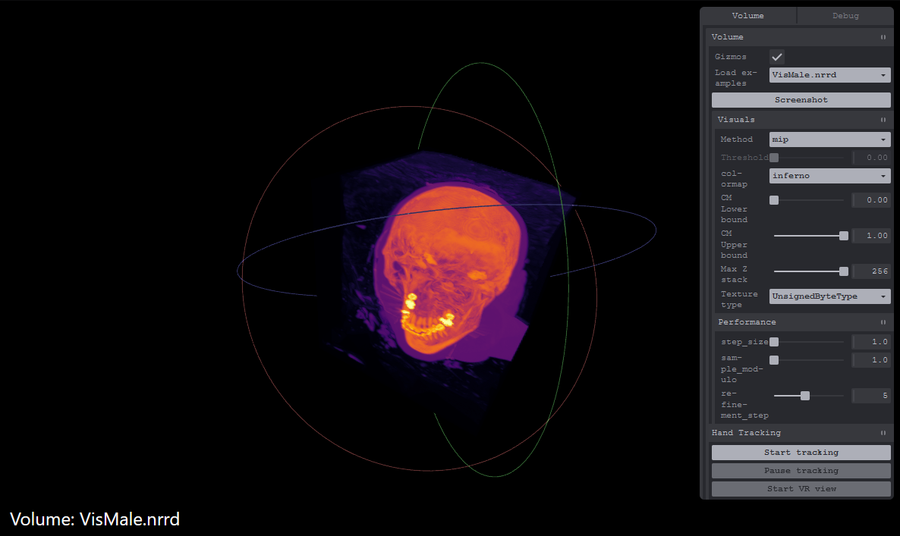

<h1 align="center">
	
	 
	QuickVol

<h3 align="center">
	
Fast and easy NRRD visualizer for the browser.

	 
	 Demo link: <a href="https://emkooz.github.io/QuickVol/">emkooz.github.io/QuickVol</a> 
	 
	 
	

</h3>
</h1>

## Usage

Only NRRD files are currently supported. Other forms of voluemtric data (such as DICOM) must be converted to NRRD first.

Hand tracking can be enabled using the "Start tracking" button. This requires a camera to be connected with permissions given.

VR view can be enabled using the "Start VR view" button. This requires a device with WebXR capibilities to be connected with permissions given.

Controls:
- Rotate - left click (or single tap) and drag
- Translate - Right click (or double tap) and drag
- Scale - Scroll wheel (or double tap and pinch/expand)

An example video of all views is included on the demo page.

## Installation

1. Make sure [node.js](https://nodejs.org/en/download/) and [pNPM](https://pnpm.io/installation) are installed.
    - pNPM can be installed with `npm install -g pnpm`
2. Clone this repository.
3. Run `pnpm i` in the base folder, which will setup the project and install all required dependencies.

If deploying remotely (such as to Github Pages), make sure to change `base` in _vite.config.js_ to the base URL that the page will be hosted on. Example: if hosting on example.com/coolwebpage, change `base` to `/coolwebpage/`

## Local Development

-   `pnpm dev` will start a local vite server which will reload on any changes.
-   `pnpm build` will compile the required files for distribution into the `dist` folder.
-   `pnpm build-dev` will build and start a vite server with the production build to confirm it built correctly.
-   `pnpm deploy-pages` will deploy everything in the _dist_ folder to the "dist" branch of the current repository (current changes are built before deploying).
